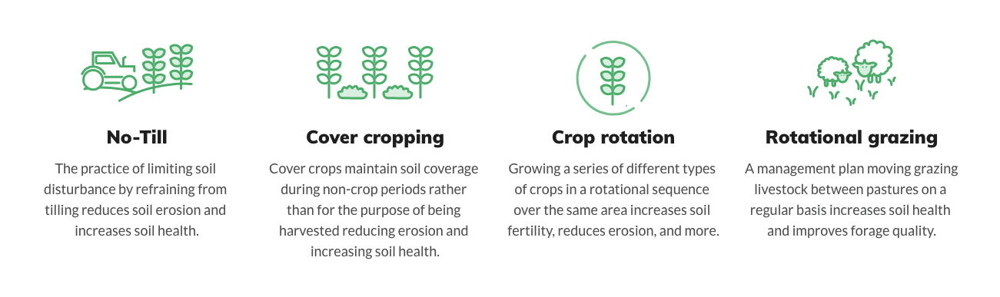
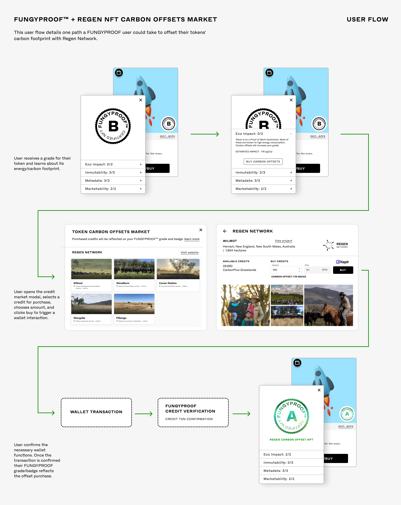
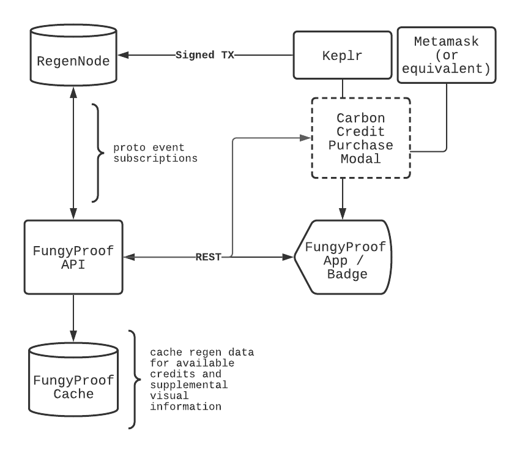

# FungyProof Regen Network Integration Proposal

This proposal was originally created for the [Green NFT Hackathon: Regen Sponsor Prize Bounty](https://gitcoin.co/issue/GreenNFT/GreenNFTs/3/100025306).

Submitted: 05/06/2021

Authors: Mike Roth, Brandon Roth

<!-- START doctoc generated TOC please keep comment here to allow auto update -->
<!-- DON'T EDIT THIS SECTION, INSTEAD RE-RUN doctoc TO UPDATE -->
## Table of Contents

- [Introduction](#introduction)
- [Background](#background)
  - [Regen Network](#regen-network)
    - [Modules](#modules)
  - [FungyProof](#fungyproof)
    - [Grading System](#grading-system)
- [Integration](#integration)
  - [Interface / UX Flow](#interface--ux-flow)
  - [Technical Requirements](#technical-requirements)
    - [Architecture Diagram](#architecture-diagram)
    - [Regen Node Infrastructure](#regen-node-infrastructure)
    - [Client Interactions](#client-interactions)
    - [Credit Purchase Methods](#credit-purchase-methods)
    - [Ethereum Payments for Carbon Credits](#ethereum-payments-for-carbon-credits)
<!-- END doctoc generated TOC please keep comment here to allow auto update -->

#  Introduction

Research suggests that many current methods of Non-Fungible Token (NFT) creation, specifically those based on Proof of Work (POW) consensus mechanisms, lead to a large carbon footprint. New technological developments including but not limited to smart contract efficiency improvements, layer 2 solutions, and alternative blockchains are improving NFT carbon footprints, however, despite these efforts millions of NFTs have already been produced and many more will continue to be produced using the original POW methods.

In order to help offset NFT emissions, this paper proposes an integration between FungyProof and the Regen Network which allows NFT creators and marketplaces to gain insights into the carbon emissions of their NFTs and purchase carbon offsets directly via a cryptocurrency wallet.

# Background

## Regen Network

Regen Network is a two-sided marketplace Blockchain built on top of the Cosmos SDK which pairs carbon credit buyers with land stewards (credit batches). Land Stewards can register a project and get paid when they validate and prove their participation in a series of sustainable land management practices.

**Land Management Practice Examples**

### Modules

The Regen Network technology is split into several modules. The three primary modules which will be used in the FungyProof / Regen integration are outlined below.

**Regen Ledger**

The Regen Ledger is a single application binary that:

*   Runs a fully functioning node in the public proof-of-stake Regen Network
*   Stores application state locally, using an [IAVL Tree](https://github.com/cosmos/iavl)
*   Exposes an API server with both gRPC and REST interfaces for querying blockchain state and sending transactions
*   Exposes a command line interface for account creation and key management as well as for querying blockchain state and sending transactions

**EcoData Module**

The data module is intended to be a versatile module for anchoring, signing, and storing data about ecological health, and ecosystem services on Regen Ledger.

**EcoCredit Module**

The Ecocredit Module is a module for managing the issuance, trading, and retiring of credits pertaining to verifiable changes in ecosystem health. Initially, the module will be used for Regen Network's own [CarbonPlus Grasslands ](https://regen-registry.s3.amazonaws.com/GHG+and+Co-Benefits+in+Grazing+Systems+Credit+Class.pdf)credit, but the module is an open platform for all credit designers, something like an ERC20 token standard for ecosystem service credits.

**Whitepaper**

[https://regen-network.gitlab.io/whitepaper/WhitePaper.pdf](https://regen-network.gitlab.io/whitepaper/WhitePaper.pdf) 

**Current Carbon Credit Batches**

[https://www.regen.network/registry/projects](https://www.regen.network/registry/projects) 

## FungyProof

FungyProof is a web application and API which uses blockchain and NFT marketplace data to surface an accessible and objective grading system for NFTs.

### Grading System

The FungyProof grading system currently consists of four different categories. 

**Eco Impact**

The ECO impact of an NFT/Marketplace is determined by the perceived amount of electricity used to generate and transfer the NFT.

**Asset Immutability**

Immutability determines how and where NFT assets are stored in relation to the blockchain token. Assets that are not stored using distributed file storage (IPFS) have a risk of going down or disappearing.

**Metadata**

Metadata determines how well the asset is categorized and can house important links to related materials such as image files. Improper Metadata will grade lower.

**Marketability**

Marketability is currently a factor of whether the NFT was minted using a common token standard such as ERC-721. This ensures cross-compatibility with multiple marketplaces.

# Integration

A core component of the FungyProof grading system is to determine the eco impact of NFTs and NFT marketplaces. Integrating the Regen network would provide access to the EcoCredit module directly from the FungyProof interface, API and embeddable badges. Once integrated, an end-user can purchase carbon credits in order to offset an NFT or NFT marketplaces carbon footprint.

## Interface / UX Flow

The following diagram illustrates the user experience (UX) flow of a Regen network integration with the FungyProof NFT embeddable badge [see: https://badge.fungyproof.com]

## Technical Requirements

### Architecture Diagram

The following diagram illustrates the technical architecture required to enable a Regen Network integration with the FungyProof application.

### Regen Node Infrastructure

To ensure a stable and scalable node infrastructure, the FungyProof backend may run a Regen Node. The Regen Node is a Go binary which can be run on any supporting VM infrastructure as outlined in the available documentation. [See: [https://docs.regen.network/api.html](https://docs.regen.network/api.html)].

Interactions with the Regen Node will include:

*   Subscribing to events (regen/ecocredit/v1alpha1/events.proto) to determine credits available for purchase for end users.
*   Interactions with the Regen EcoData module to obtain information on credit batches to surface detailed information to the FungyProof Regen modal.

*   Broadcasting signed transactions for credit purchases.

### Client Interactions

Interactions with the node may be done directly via the Keplr wallet on the client.
[See: https://keplr.xyz/]

Signing and broadcasting functionality will need to be built to enable client-side interactions with the Regen Node. 

**Example Signing Interface**

The following is an example of a client-based transaction signing and broadcast. The example would need to be modified to support Regen:

[See: [https://github.com/chainapsis/keplr-example/blob/master/src/main.js](https://github.com/chainapsis/keplr-example/blob/master/src/main.js)]

**Broadcasting Signed Transactions**

An RPC gateway is currently under development, however, once the grpc gateway is available signed transactions will be broadcast from the UI to the node directly.

[See: [https://github.com/grpc-ecosystem/grpc-gateway](https://github.com/grpc-ecosystem/grpc-gateway)]

### Credit Purchase Methods

Various methods of credit purchases and/or trading could be enabled through smart contract interactions once smart contract support is released.

### Ethereum Payments for Carbon Credits

By making use of the cosmos gravity bridge an ethereum transaction could theoretically be used to purchase Regen credits. This would need further exploration regarding exact implementation details.

[See: [https://github.com/cosmos/gravity-bridge](https://github.com/cosmos/gravity-bridge)]
